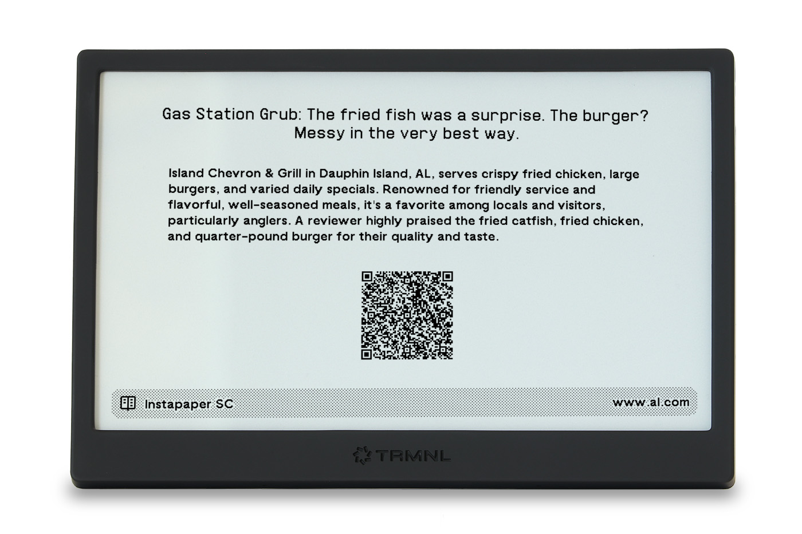

# Read It Later for TRMNL

This shortcut sends an article to your TRMNL with a convenient QR code so you can read it later.

Found an article, but don’t have time to read it? Let your TRMNL hold on to it for you!

- [About This Plugin](#about-this-plugin)
- [General Requirements](#general-requirements)
- [Installation and Use](#installation-and-use)
- [Integrations and Modifications](#integrations-and-modifications)



## About this plugin
[Shortcuts][3] is a built-in application on iOS and iPadOS (also macOS) that runs actions and automations. [TRMNL Companion][1] is an app provided by [TRMNL][4] for easily sending data to your TRMNL screen from an iOS device.

Shortcuts leverages different [“content types”][5] in its actions. When you provide this shortcut with a URL (either directly or through the Share Sheet), the shortcut converts the URL to the “Article” type, and collects some attributes of the Article (title, domain, etc.) into a Shortcuts “Dictionary” (like a JSON object). 

The shortcut then uses the “Send Data to Plugin” action provided by TRMNL Companion to format and send the Dictionary to the TRMNL plugin.

### Apple Intelligence
The shortcut uses two free Apple Intelligence actions to summarize the article for display on the plugin: “Summarize Text” and “Use Cloud Model."

“Summarize Text” receives the “Body” attribute of Article (some or all of the article text) and summarizes it.

“Summarize Text” does not offer any parameters, so the summary can be too long (more than 75 words) or too short (less than 50 words). In those instances, “Use Cloud Model” explicitly rewrites the summary to about 75 words.[^1]

Note that, as with all LLMs, the Apple Intelligence models can make mistakes, especially if the “Body” attribute provided by the Article is short, incomplete, or contains nuance (satire, etc.). The summary sent to TRMNL may not accurately reflect the content of the article. 

The Read It Later TRMNL plugin *can* be used without Apple Intelligence, TRMNL Companion, and even without Shortcuts. See [Integrations and Modifications](#integrations-and-modifications) for more information.

## General requirements
- iOS 18/iPadOS 18 or higher
- Device with Apple Intelligence
- [Send URL to TRMNL][2] shortcut
- [TRMNL Companion app][1]

For alternatives, see [Integrations and Modifications](#integrations-and-modifications).

## Installation and use
- Install the TRMNL Read It Later plugin (*link to come*) in your TRMNL dashboard.
- Make sure [TRMNL Companion][1] is installed on your iOS device and logged in to your account.
- Follow the link to [install the shortcut in the Shortcuts app][2]. The shortcut should prompt you to choose your Read It Later plugin instance.

Run the shortcut and enter a URL when prompted, or browse to a webpage and share to the shortcut from the Share Sheet. For best results, choose an article rather than a website's or publication’s homepage.

## Integrations and modifications
At its simplest, the Read It Later plugin is a [webhook-based TRMNL plugin][6] that uses the following keys: `title`, `description` (summary), `url`, and `source` (the website domain). It is therefore possible to provide this data in other ways, as long as it is ultimately combined into a Dictionary or JSON object and sent to TRMNL nested in a `merge_variables/data` object.

```
{
  "merge_variables": {
    "data": {
      "title": "Article title",
      "description": "Article summary",
      "url": "Full article URL",
      "source": "Article domain"
    }
  }
}
```

### Other read it later services
For instance, the Instapaper “Random Article” Shortcuts action provided by the [Instapaper iOS app][7] retrieves a random article from your Instapaper queue in Article-like format that contains a URL attribute. With some modification, the URL can be provided to the shortcut and, following the same logic, send a random article from your Instapaper account to your TRMNL. Other “read it later” services can be integrated similarly.

### Other LLMs
Different LLM services can also be integrated with this shortcut by replacing the “Summarize” and/or “Use Model” action steps with Shortcuts actions provided by other LLM apps. Due to the layout of the Read It Later plugin, it is not recommended to remove the summary-generating logic entirely, but it is possible to send the `description` value as blank and the TRMNL plugin will still function.

### Other platforms
Again, under the hood, this Shortcuts/TRMNL Companion integration is a convenience method of sending a `merge_variables` object to a TRMNL webhook, containing the `title`, `description`, `url`, and `source` key/value pairs. To that end, it is possible to use the Read It Later plugin with any method that can send a `POST` command, including `curl`.

**Happy reading!**

[^1]: The “Summarize” action does not offer parameters for summary length. At the same time, “Use Model” can often be overwhelmed by long “Body” text and return an error. By combining “Summarize” and “Use Model” together, we get text that the model can handle and a result at the right length.

[1]: https://help.trmnl.com/en/articles/12294875-trmnl-companion-for-ios
[2]: https://www.icloud.com/shortcuts/055064f1da3441c8881802cc629e69c7
[3]: https://support.apple.com/guide/shortcuts/welcome/ios
[4]: https://trmnl.com
[5]: https://support.apple.com/guide/shortcuts/input-types-apd7644168e1/9.0/ios/26
[6]: https://docs.trmnl.com/go/private-plugins/webhooks
[7]: https://www.instapaper.com/iphone
